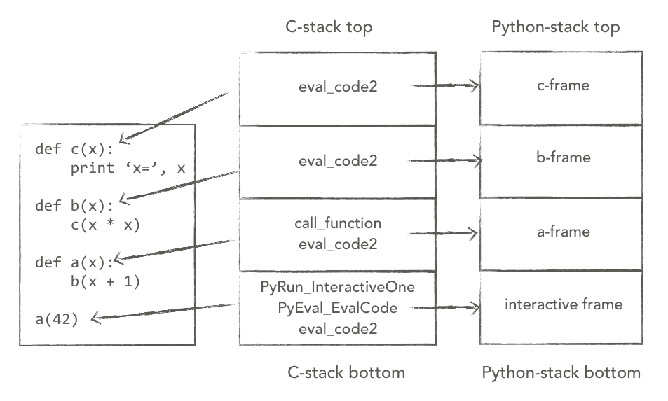
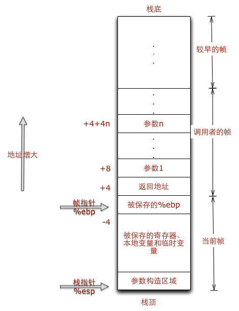

dig into greenlet


py 虚拟机原理 【引用自 2 】

Python虚拟机的原理是通过栈帧对象PyFrameObject抽象出运行时（栈，指令，符号表，常量表等），通过执行PyEval_EvalFrameEx这个C级别的函数来逐个解析字节码指令。


要想在Python中在两个子过程中作任意的挂起和恢复的话，需要做到两点：

保存当前子过程的执行栈。

恢复目标子过程的执行栈，并恢复栈顶的状态继续执行。


500 行

In general, there's a frame for each scope in a Python program. For example, each module, each function call, and each class definition has a frame.

python virtual machine

```python
def a(x):
    b(x + 1)

def b(x):
    c(x * x)

def c(x):
    print 'x=', x

a(42)
```


图片引用自 [Stackless Python 探秘][]


图片引用自 [python的Greenlet模块源码分析][]

### asm
The compiler does not parse your assembly code. It needs the clobber list to figure out which registers your code will modify. [refer](https://stackoverflow.com/questions/26191261/extended-asm-in-gcc-asm-operand-has-impossible-constraints)

#### 寄存器
EIP Extended Instruction Pointer 下一个 CPU 指令存放的内存地址
ESP Extended Stack Pointer 栈（顶）指针
EBP Extended Base Pointer  帧指针  frame pointer

#### 汇编指令
movX source, dest

addX source, dest => d += s

FLDCW: Stores the current value of the FPU control word at the specified destination in memory. [link](https://www.felixcloutier.com/x86/fstcw:fnstcw)

STMXCSR: Stores the contents of the MXCSR control and status register to the destination operand. [link](https://www.felixcloutier.com/x86/stmxcsr)

##### 相关的限制字符
"a" 将输入变量放入eax。如果 %eax 已经被使用，它在这段汇编代码的起始处插入一条语句pushl %eax，将eax 内容保存到堆栈，然后在这段代码结束处再增加一条语句popl %eax，恢复eax的内容
"m" 内存变量
"g" 将输入变量放入eax，ebx，ecx，edx中的一个或者作为内存变量


引用自 [a deep dive into how gevent works][]

two stack: normal c stack and python virtual machine stack

stack slicing, which is implemented in assembly


源码阅读

#### stack
Stack layout for a greenlet:

               |     ^^^       |
               |  older data   |
               |               |
  stack_stop . |_______________|
        .      |               |
        .      | greenlet data |
        .      |   in stack    |
        .    * |_______________| . .  _____________  stack_copy + stack_saved
        .      |               |     |             |
        .      |     data      |     |greenlet data|
        .      |   unrelated   |     |    saved    |
        .      |      to       |     |   in heap   |
 stack_start . |     this      | . . |_____________| stack_copy
               |   greenlet    |
               |               |
               |  newer data   |
               |     vvv       |


#### greenlet 的状态
States:
  stack_stop == NULL && stack_start == NULL:  did not start yet
  stack_stop != NULL && stack_start == NULL:  already finished
  stack_stop != NULL && stack_start != NULL:  active

TODO, needcheck
stack_start => NULL dead

run_info
正常情况 PyThreadState_GET()->dict
if == NULL 垃圾回收中


#### 一些全局变量
```c
/* Weak reference to the switching-to greenlet during the slp switch */
static PyGreenlet* volatile ts_target = NULL;
/* Strong reference to the switching from greenlet after the switch */
static PyGreenlet* volatile ts_origin = NULL;
/* Strong reference to the current greenlet in this thread state */
static PyGreenlet* volatile ts_current = NULL;
/* NULL if error, otherwise args tuple to pass around during slp switch */
static PyObject* volatile ts_passaround_args = NULL;
static PyObject* volatile ts_passaround_kwargs = NULL;
```

#### 一些宏函数

```c
#define PyGreenlet_Check(op)      PyObject_TypeCheck(op, &PyGreenlet_Type)
#define PyGreenlet_MAIN(op)       (((PyGreenlet*)(op))->stack_stop == (char*) -1)
#define PyGreenlet_STARTED(op)    (((PyGreenlet*)(op))->stack_stop != NULL)
#define PyGreenlet_ACTIVE(op)     (((PyGreenlet*)(op))->stack_start != NULL)
```

一些 ts 的变量
```c
ts_curkey = PyString_InternFromString("__greenlet_ts_curkey");
ts_delkey = PyString_InternFromString("__greenlet_ts_delkey");
```

[tp_is_gc](https://docs.python.org/2/c-api/typeobj.html#c.PyTypeObject.tp_is_gc)
[tp_clear](https://docs.python.org/2/c-api/typeobj.html#c.PyTypeObject.tp_clear)
[tp_dealloc](https://docs.python.org/2/c-api/typeobj.html#c.PyTypeObject.tp_dealloc)


#### 几个 py 的 c 函数
```c
PyThreadState* PyThreadState_Get()
Return the current thread state. The global interpreter lock must be held. When the current thread state is NULL, this issues a fatal error (so that the caller needn’t check for NULL).

PyObject* PyThreadState_GetDict()
Return value: Borrowed reference.
Return a dictionary in which extensions can store thread-specific state information. 

void* PyMem_Realloc(void *p, size_t n)
Resizes the memory block pointed to by p to n bytes. The contents will be unchanged to the minimum of the old and the new sizes.

void Py_CLEAR(PyObject *o)
Decrement the reference count for object o. The object may be NULL
```

GIL

The Python interpreter keeps some thread-specific bookkeeping information inside a data structure called PyThreadState. There’s also one global variable pointing to the current PyThreadState: it can be retrieved using PyThreadState_Get().

[sys.setcheckinterval(interval)](https://docs.python.org/2.7/library/sys.html#sys.setcheckinterval)


#### 

[Stack layout](https://github.com/python-greenlet/greenlet/blob/master/greenlet.c#L15)

[PyGreenlet_Type](https://github.com/python-greenlet/greenlet/blob/master/greenlet.c#L1500)


Refer:
- [Kavya Joshi - A tale of concurrency through creativity in Python: a deep dive into how gevent works.][a deep dive into how gevent works]
- [A Python Interpreter Written in Python]


Kavya Joshi - A tale of concurrency through creativity in Python: a deep dive into how gevent works.

greenlet上下文切换的原理
Python协程greenlet实现原理
Stackless Python 探秘


----

在python, 线程状态信息的抽象是通过 PyThreadState 对象来实现的, 一个线程将拥有一个PyThreadState对象. PyThreadState不是模拟线程, 而是对线程状态的抽象.

行号一览：
gr 实例的方法定义 PyMethodDef green_methods #1459
gr 实例的属性定义 PyGetSetDef green_getsets #1467
模块级别的方法PyMethodDef GreenMethods #1594
PyGreenlet_Type 定义 #1500
green_switch #1117
g_switch #560
green_create_main #171
slp_save_state #425
slp_restore_state #402
g_save #372
g_switchstack #453

PyThreadState->frame[https://github.com/python/cpython/blob/2.7/Include/pystate.h#L62]
PyFrameObject[https://github.com/python/cpython/blob/2.7/Include/frameobject.h#L16]


#### c integrate

```c
initgreenlet(void) 
```
The method table must be passed to the interpreter in the module’s initialization function. The initialization function must be named initname(), where name is the name of the module, and should be the only non-static item defined in the module file ref: [Extending Python with C or C++][]


The GIL is a single lock on the interpreter itself which adds a rule that execution of any Python bytecode requires acquiring the interpreter lock. 


[a deep dive into how gevent works]: https://www.youtube.com/watch?v=GunMToxbE0E&t=128s
[A Python Interpreter Written in Python]: https://www.aosabook.org/en/500L/a-python-interpreter-written-in-python.html
[Anjana Vakil - Exploring Python Bytecode]: https://www.youtube.com/watch?v=GNPKBICTF2w
[Coroutines, event loops, and the history of Python generators]: https://www.youtube.com/watch?v=b7R3-_ViNxk
[Stackless Python 探秘]: https://www.shymonk.com/posts/2016/06/stackless-python-tan-mi/
[python的Greenlet模块源码分析]: http://rootk.com/post/python-greenlet.html
[GCC在C语言中内嵌汇编 asm __volatile__]: https://blog.csdn.net/pbymw8iwm/article/details/8227839
[Review of assembly language]: http://www.scs.stanford.edu/nyu/04fa/notes/l2.pdf
[python协程的实现（greenlet源码分析）]: https://blog.csdn.net/fjslovejhl/article/details/38824963
[2. Defining New Types]: https://docs.python.org/2/extending/newtypes.html
[Extending Python with C or C++]: https://docs.python.org/2.7/extending/extending.html#the-module-s-method-table-and-initialization-function
[Python内核阅读(九): 虚拟机框架]: https://www.hongweipeng.com/index.php/archives/1233/
[Linux 中 x86 的内联汇编]: https://www.ibm.com/developerworks/cn/linux/sdk/assemble/inline/index.html
[Thread State and the Global Interpreter Lock]: https://docs.python.org/2.7/c-api/init.html#thread-state-and-the-global-interpreter-lock
[Python GIL 多线程机制 （C source code)]: https://www.cnblogs.com/lxk613/p/4858818.html

https://www.jianshu.com/p/cd41c14b19f4
